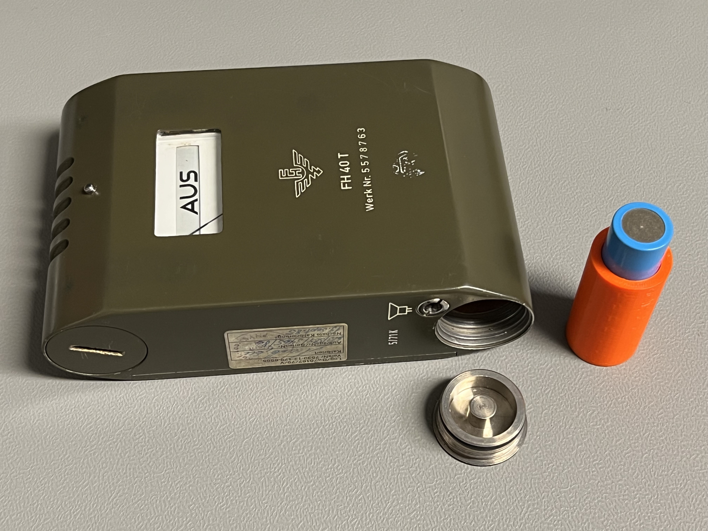
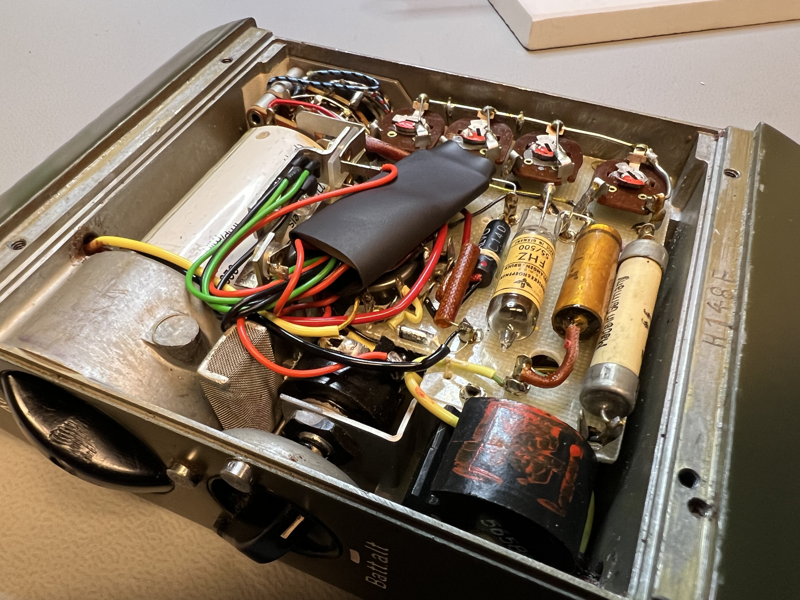
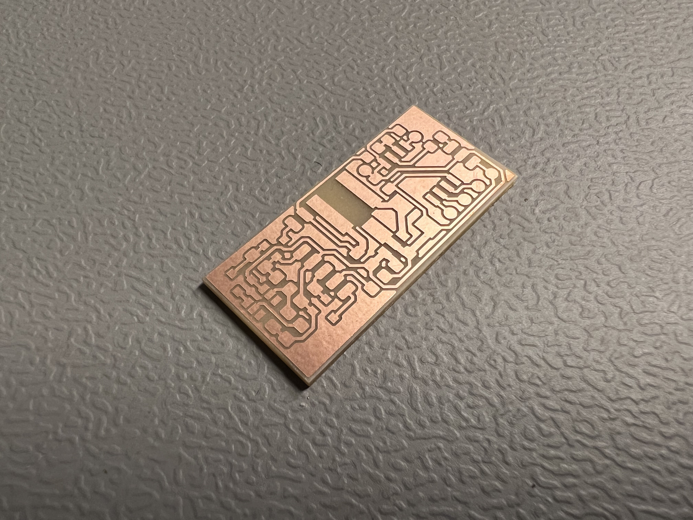
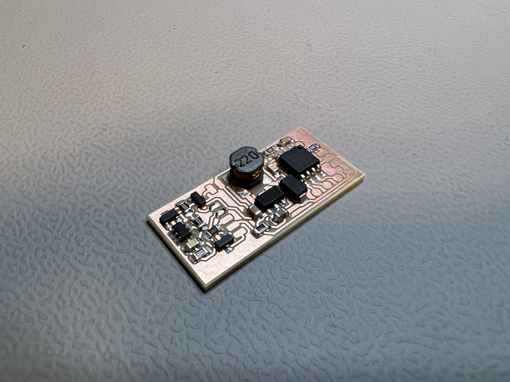
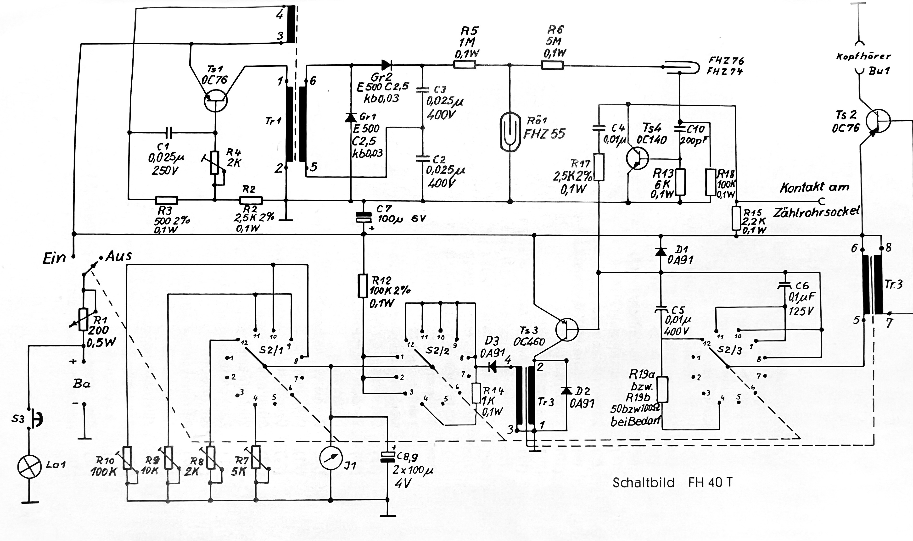

# FH40T conversion to lithium battery  

The FH40T is a quite popular antique geiger counter in Germany from company Frieseke and Hoepfner.  
This particular unit is marked with the year of manufacture 1963.  
Originally it was powered by a long forgotten 6V battery or a NiCd rechargable battery.  
The previous owner built a small adapter to use two CR-V3 lithium batteries in series.  
I figured it could be powered by a modern standard 18650 rechargable lithium batery.  

  
  

Needed was a adapter sleeve to fit the 18650 in the battery compartment, a protection circuit for the lithium cell and a step up converter to get a constant voltage.  
In addition I wanted to have some sort of carge indicator.  

## Protection circuit  

The protection circuit only needs to protect the cell against over discharging and is built around the standard DW01A protection IC.  
The only problem is, that normally it switches the low side of the connection. This can not be done with the FH40T because the whole case is used as ground.  
Therefore the P-channel MOSFET Q1 is used with help of Q2 to switch off the high side when the cell reaches 2.5V. R1 keeps the gate of Q1 discharged.  

## Step up converter  

The step up converter is built using the ME2108A IC I desoldered from a tiny step up module together with the schottky diode and inductor to provide a stable-ish voltage between 4.3V and 7V.  

## Charge indicator  

The charge indicator uses an ATtiny85 microcontroller that measures the voltage of the cell through a voltage divider consisting of R7 and R8, C4 was added in parallel to R8 for some low pass filtering.  
Although the controller is powered by the 5V from the step up it needs to use the internal 2.56V reference as the 5V is not stable enough.  
The cell voltage is displayed after the device is switched on by flashing a super bright red LED behind the scale and every time the voltage dropped by 100mV. Once the voltage dropped below 3V the LED flashes every 4s.  

## Lighting the scale  

Originally the scale was lit by a little incendescant bulb. Now a bright white LED is used switched on via Q3.  

## The PCB  

The PCB is a simple single sided board manufactures by isolation milling with my ISEL PCB router.  

  
  

For interest here is the original schematic:  

